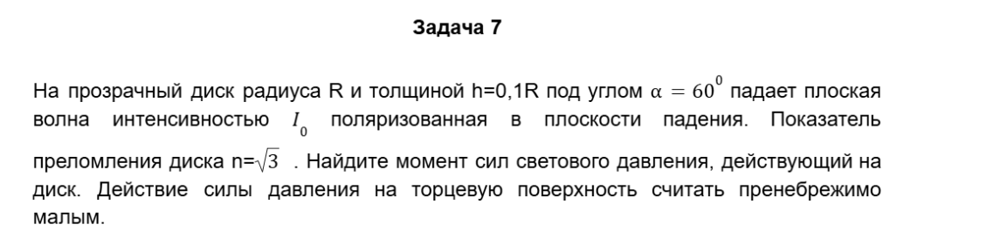
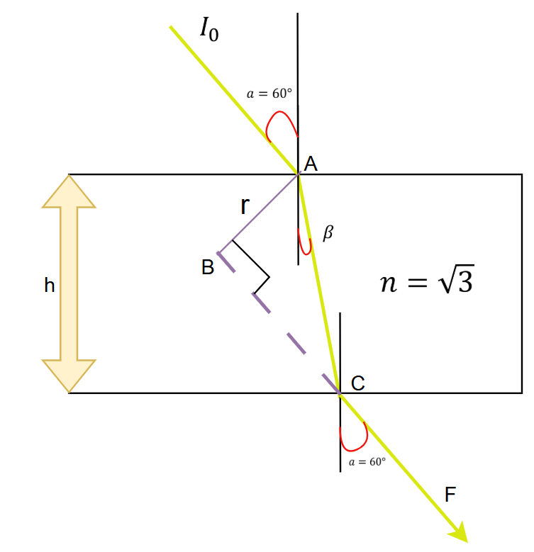

**Решение**:

### Про особенность угла в 60 градусов

Заметим, что данный угол является углом Брюстера

$tg(60) = \sqrt{3} = n - угол\ Брюстера$

Так-как поляризация у нас параллельная, то весь свет проходит через
пластинку (нет отражения).

В качестве точки, относительно которой будет считаться момент возьмем
точку A (потому как тогда плечи как падающего света, так и преломленного
будут равны 0, и для расчета момента останется 1 слагаемое в точке C)

Основной причиной того, что мы будет рассматривать данную точку, а далее
обобщим результат на все остальные является то, что на моменты создаются
парой сил, а момент пары, как мы знаем, не зависит от точки
рассмотрения.

### Находим расстояние

Из геометрии видно, что длина луча в материале $l$ равна:

$h = l \cdot sin(\beta)$

$l = \frac{h}{\sin(\beta)}$

Также, из геометрии выразим расстояние $r$

Заметим, что угол $BAC = \ \beta + 90 - a$

$r = l \cdot \cos(BAC) = l \cdot \cos(\beta - a + 90)$

Вспомним, что для угла Брюстера:

$a + \ \beta = 90{^\circ}$

$r = l \cdot \cos(\beta - a + 90) = l \cdot \cos(180 - 2 \cdot a) = l \cdot \cos(180 - 120) = l \cdot \cos(60) = \frac{l}{2}$

Подставим вычисленное ранее значение $l$

$r = \frac{l}{2} = \frac{h}{2*\sin(\beta)} = \frac{h}{2*\sin(90 - a)} = \frac{h}{2*cos(a)} = \frac{h}{\sqrt{3}}$

### Находим силу

$F = \frac{\mathrm{\Delta}p}{\mathrm{\Delta}t} = \frac{\frac{\mathrm{\Delta}E}{c}}{\mathrm{\Delta}t} = \frac{\mathrm{\Delta}E}{\mathrm{\Delta}t} \cdot \frac{\mathrm{\Delta}S}{\mathrm{\Delta}S} \cdot \frac{1}{c} = I_{0} \cdot \frac{S}{c} = \frac{I_{0} \cdot \pi \cdot R^{2}}{c}$

$M = F \cdot r = \frac{I_{0} \cdot \pi \cdot R^{2}}{c} \cdot \frac{h}{\sqrt{3}} = \frac{\pi \cdot 0.1}{c \cdot \sqrt{3}} \cdot I_{0} \cdot R^{3} = 6.04 \cdot 10^{- 10} \cdot I_{0} \cdot R^{3}\ (Н \cdot м)$
