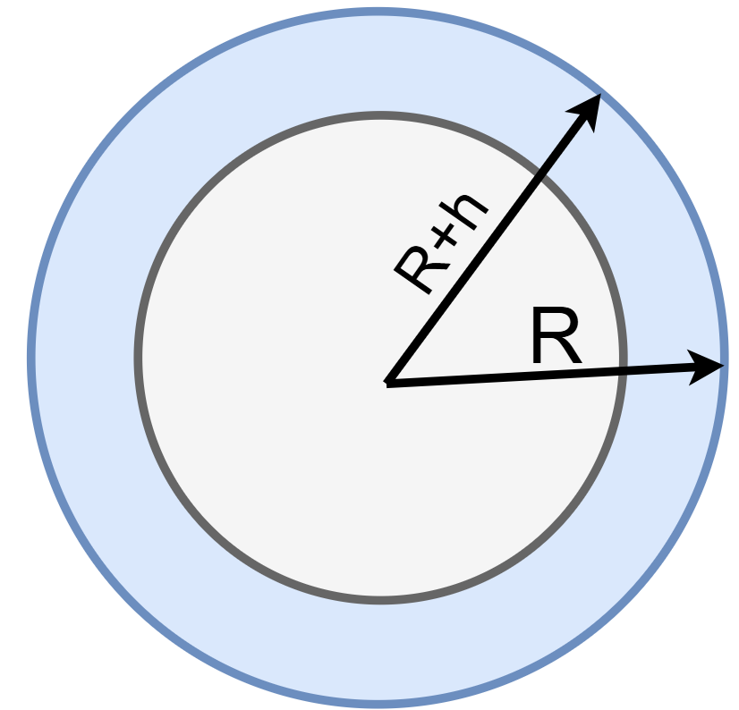
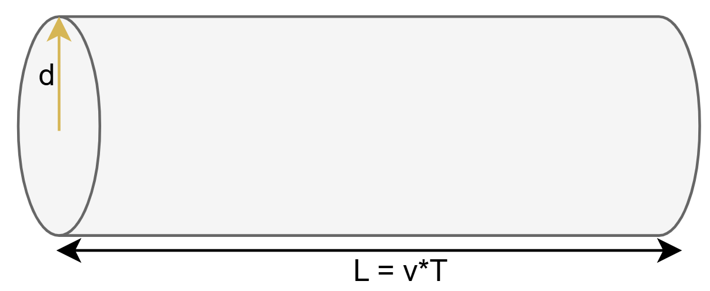

# Задача 8

В настоящее время в околоземном пространстве находится \( 10^4 \) рукотворных тел (спутники, обломки аварий и т.п.). Принимая толщину «заселенного» слоя атмосферы равной 100 км, а характерный размер объектов – 1 м, оцените время между столкновениями любых двух рукотворных тел.

**Оценим конентрацию обломков**

$V = 4\pi R^{2} \cdot h = \left( 6350 \cdot 10^{3} \right)^{2} \cdot 100 \cdot 10^{3} \cdot 4 \cdot 3.14 = 5 \cdot 10^{19}\ м^{3}$

$n = \frac{N}{V} = \frac{10^{4}}{5 \cdot 10^{19}} = 2 \cdot 10^{- 16}\ м^{- 3}\ $

**Оценка пролета для столкновения**

$\mathrm{\Delta}N = n \cdot S \cdot T \cdot v = 1 - условие\ столкновения\ 2\ частиц$

$v = \sqrt{\frac{GM}{R}} = 7.9*10^{3}\ \frac{м}{с}$

$S = \pi*d^{2} = 3.14\ м^{2}$

$T = \frac{1}{S \cdot v} \cdot \frac{1}{n} = \frac{1}{3.14} \cdot \frac{1}{7.9 \cdot 10^{3}} \cdot 0.5 \cdot 10^{16} = 8 \cdot 10^{11}\ с = 613589\ лет$

Если же еще учесть корень из 2 для относительного движения, то будет

$T = 433873\ лет$
